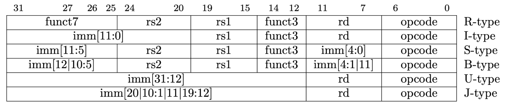
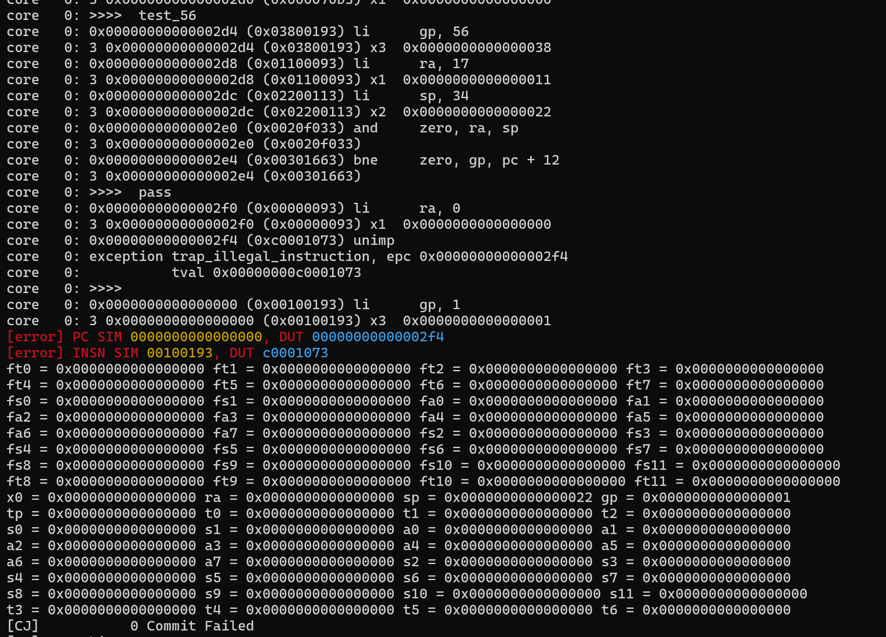
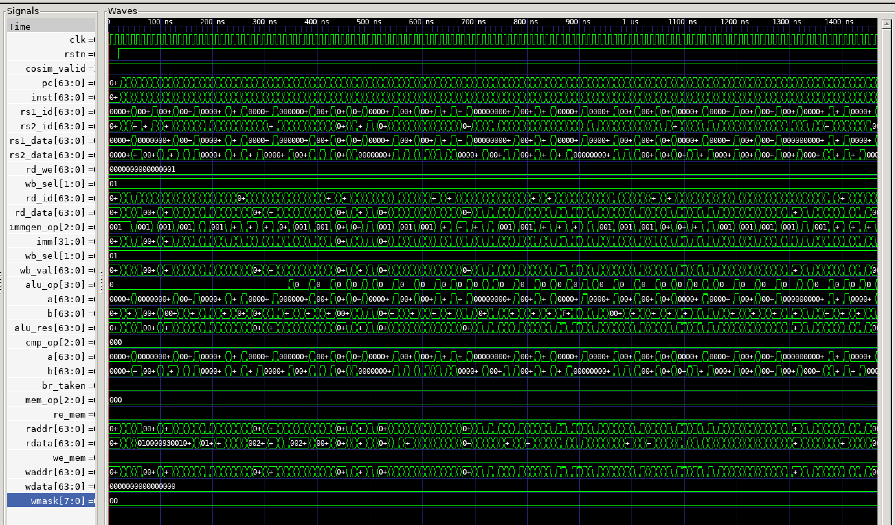
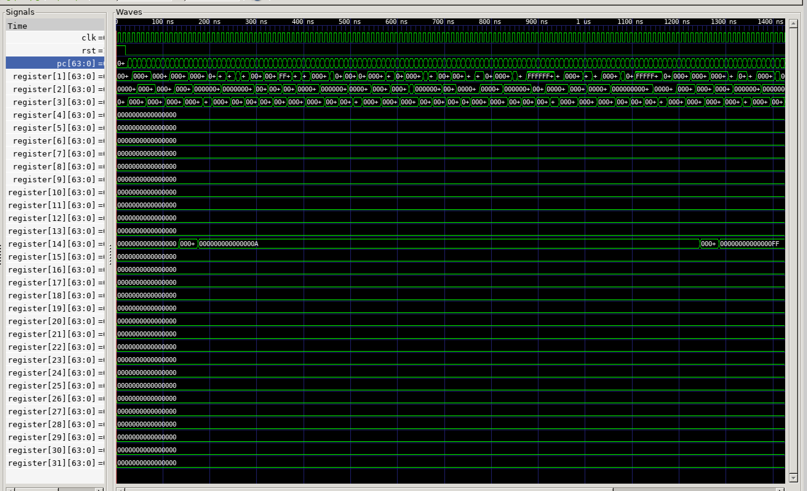
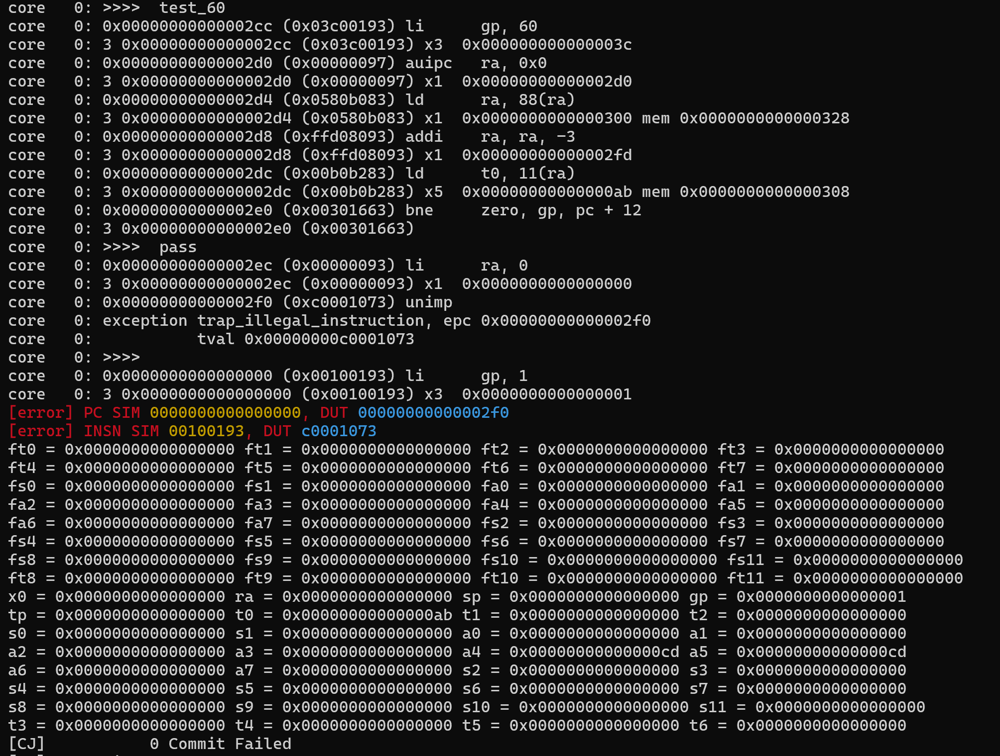
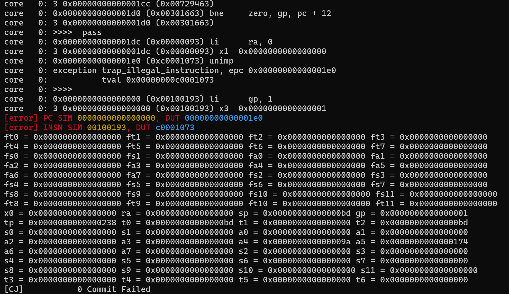
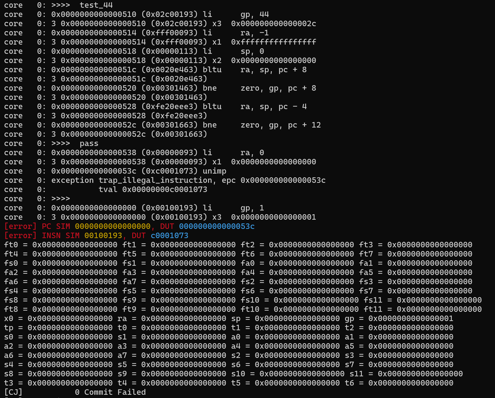
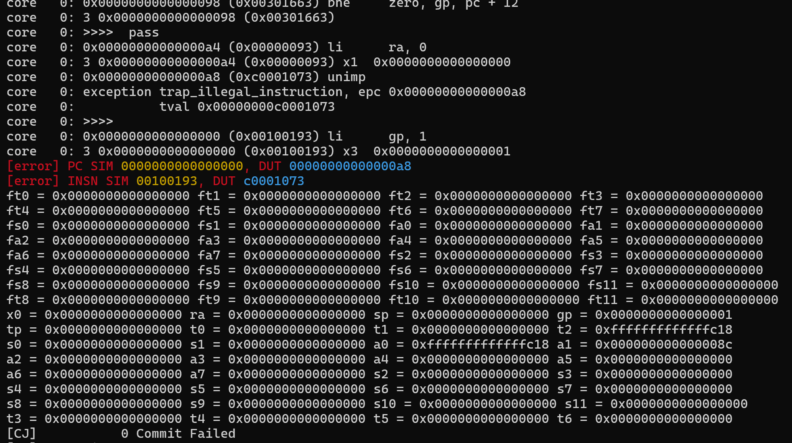
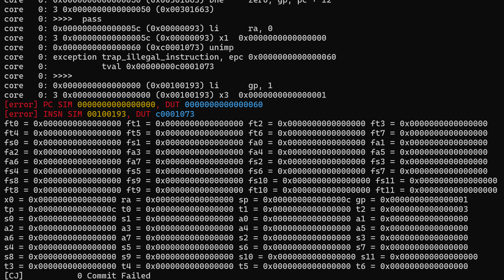
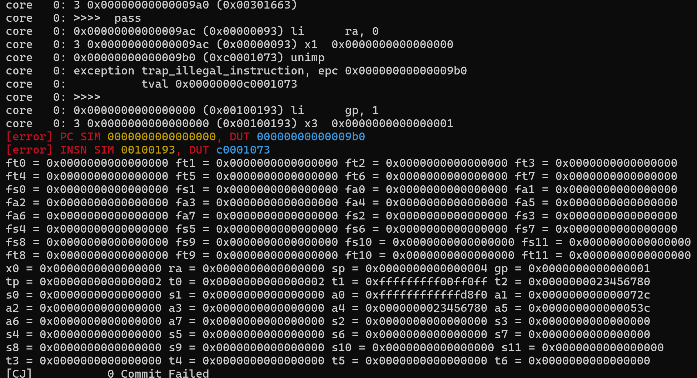

# <center> Project: 单周期 CPU
## <center> Author: lxj
---
<!-- pagebreak -->


# Part 1: 单周期 CPU 数据通路设计
---
<!-- pagebreak -->


## Register File 
### 功能
管理寄存器堆，对寄存器进行读写操作
### 设计
#### 相关头文件
```v
 parameter xLen = 64;
    parameter ADDR_WIDTH = xLen;
    parameter DATA_WIDTH = xLen;
    parameter MASK_WIDTH = DATA_WIDTH/8;
    typedef logic [ADDR_WIDTH-1:0] addr_t;
    typedef logic [DATA_WIDTH-1:0] data_t;
    typedef logic [MASK_WIDTH-1:0] mask_t;
    typedef logic [31:0] inst_t;
    typedef logic [4:0] reg_ind_t;
```
#### 源代码
```v
`include "core_struct.vh"
module RegFile (
  input clk,
  input rst,
  input we,
  input CorePack::reg_ind_t  read_addr_1,
  input CorePack::reg_ind_t  read_addr_2,
  input CorePack::reg_ind_t  write_addr,
  input  CorePack::data_t write_data,
  output CorePack::data_t read_data_1,
  output CorePack::data_t read_data_2
);
  import CorePack::*;

  integer i;
  data_t register [1:31]; // x1 - x31, x0 keeps zero

  // fill your code
  assign read_data_1 = (read_addr_1 == 0) ? 0 : register[read_addr_1];
  assign read_data_2 = (read_addr_2 == 0) ? 0 : register[read_addr_2];

  always @(posedge clk or posedge rst) begin
    if(rst) begin
      for(i = 1; i <= 31; i = i + 1) begin
        register[i] <= 0;
      end
    end
    else begin 
      if(we && (write_addr != 0)) begin
        register[write_addr] <= write_data;
      end
    end 
  end

endmodule
```
---
## ALU
### 功能
根据运算类型对数据进行算术和逻辑运算
### 数据来源
a 和 b 可能来自寄存器/立即数
### 设计
#### 相关头文件
```v
typedef enum logic [3:0] {
        ALU_ADD,  ALU_SUB,  ALU_AND,  ALU_OR,
        ALU_XOR,  ALU_SLT,  ALU_SLTU, ALU_SLL,
        ALU_SRL,  ALU_SRA,  ALU_ADDW, ALU_SUBW,
        ALU_SLLW, ALU_SRLW, ALU_SRAW, ALU_DEFAULT
    } alu_op_enum;
```
#### 源代码
```v
`include "core_struct.vh"
module ALU (
  input  CorePack::data_t a,
  input  CorePack::data_t b,
  input  CorePack::alu_op_enum  alu_op,
  output CorePack::data_t res
);

  import CorePack::*;

  // fill your code
  logic [31 : 0] temp32;
  // verilator lint_off LATCH
  always_comb begin 
    case(alu_op) 
      ALU_ADD: res = a + b;
      ALU_SUB: res = a - b;
      ALU_AND: res = a & b;
      ALU_OR: res = a | b;
      ALU_XOR: res = a ^ b;
      ALU_SLT: res = ($signed(a) < $signed(b)) ? 64'b1 : 64'b0;       // $signed() 转化为有符号数
      ALU_SLTU: res = (a < b) ? 64'b1 : 64'b0;            // verilog 默认当做无符号数比较
      ALU_SLL: res = a << b[5:0];              // 最多移位不超过64位，只占6bit
      ALU_SRL: res = a >> b[5:0];
      ALU_SRA: res = $signed(a) >>> b[5:0];
      ALU_ADDW: begin
        temp32 = $signed(a[31:0]) + $signed(b[31:0]);
        res = {{32{temp32[31]}},temp32};
      end
      ALU_SUBW: begin
        temp32 = a[31:0] - b[31:0];
        res = {{32{temp32[31]}},temp32};
      end
      ALU_SLLW: begin
        temp32 = a[31:0] << b[4:0];             // 最多移位不超过32位，只占5bit
        res = {{32{temp32[31]}},temp32};
      end
      ALU_SRLW: begin
        temp32 = a[31:0] >> b[4:0];                 // verilog 默认逻辑右移
        res = {{32{temp32[31]}},temp32};
      end
      ALU_SRAW: begin
        temp32 = $signed(a[31:0]) >>> b[4:0];
        res = {{32{temp32[31]}},temp32};
      end
      default: res = '0;
    endcase
  end
  // verilator lint_on LATCH
endmodule
```
#### 注意点
##### 有符号数 & 无符号数
- RICS_V指令中的计算默认操作数为**有符号数**，如果是字型计算，需要符号扩展；而 Verilog 中默认为**无符号数**，
- Verilog 中 `>>` 表示逻辑右移，表示算数右移要使用 `>>>` 并搭配 `$signed()`
##### 位宽
- RISC-V 中计算指令按操作数位宽分有64位（默认）和32位（指令最后有w）两种
- 32位字型计算只有加（减）、移位： add(i)w,subw,sll(i)w,srl(i)w,sra(i)w
##### 移位操作
- 双字：低6位决定
- 字：低5位决定

---
## Cmp
### 功能
通过逻辑和算术运算来判断 B 型指令是否满足跳转条件

### 数据来源
寄存器（B 型指令结构决定）

### 设计
#### 相关头文件
```v
typedef enum logic [2:0] {
    CMP_NO,  CMP_EQ,  CMP_NE,  CMP_LT,
    CMP_GE,  CMP_LTU, CMP_GEU, CMP7
} cmp_op_enum;
```
#### 源代码
```v
`include"core_struct.vh"
module Cmp (
    input CorePack::data_t a,
    input CorePack::data_t b,
    input CorePack::cmp_op_enum cmp_op,
    output cmp_res
);

    import CorePack::*;

    // fill your code
    logic res;
    always_comb begin
        case(cmp_op)
            CMP_NO: res = 0;
            CMP_EQ: res = (a == b);
            CMP_NE: res = (a != b);
            CMP_LT: res = ($signed(a) < $signed(b));
            CMP_GE: res = ($signed(a) >= $signed(b));
            CMP_LTU: res = (a < b);
            CMP_GEU: res = (a >= b);
            CMP7: res = 0;
            default: res = 0;
        endcase
    end

    assign cmp_res = res;
    
endmodule
```

---
## Data package
### 功能
将写入内存的数据改为64位/8B
### 设计
#### 相关头文件
```v
typedef enum logic [2:0] {
    MEM_NO, MEM_D,  MEM_W,  MEM_H,
    MEM_B,  MEM_UB, MEM_UH, MEM_UW
} mem_op_enum;
```
#### 源代码
```v
`include "core_struct.vh"

module DataPkg(
    input CorePack::mem_op_enum mem_op,
    input CorePack::data_t reg_data,
    input CorePack::addr_t dmem_waddr,
    output CorePack::data_t dmem_wdata
);

  import CorePack::*;

  // Data package
  // fill your code

  logic [2:0] offset;
  assign offset = dmem_waddr[2:0];
  
  always_comb begin  
    dmem_wdata = '0;
    case(mem_op)
      MEM_NO: dmem_wdata = '0;
      MEM_D: dmem_wdata = reg_data;
      MEM_W, MEM_UW:begin
        case(offset[2])
          1'b0: dmem_wdata[31:0] = reg_data[31:0]; 
          1'b1: dmem_wdata[63:32] = reg_data[31:0];
        endcase
      end
      MEM_H, MEM_UH:begin
        case(offset[2:1])
          2'b00: dmem_wdata[15:0] = reg_data[15:0];
          2'b01: dmem_wdata[31:16] = reg_data[15:0];
          2'b10: dmem_wdata[47:32] = reg_data[15:0];
          2'b11: dmem_wdata[63:48] = reg_data[15:0];
        endcase
      end
      MEM_B, MEM_UB:begin
        case(offset)
          3'b000: dmem_wdata[7:0] = reg_data[7:0];
          3'b001: dmem_wdata[15:8] = reg_data[7:0];
          3'b010: dmem_wdata[23:16] = reg_data[7:0];
          3'b011: dmem_wdata[31:24] = reg_data[7:0];
          3'b100: dmem_wdata[39:32] = reg_data[7:0];
          3'b101: dmem_wdata[47:40] = reg_data[7:0];
          3'b110: dmem_wdata[55:48] = reg_data[7:0];
          3'b111: dmem_wdata[63:56] = reg_data[7:0];
        endcase
      end 
      default: dmem_wdata = '0;
    endcase
  end

endmodule
```

#### 注意点
- store指令不区分有符号数和无符号数，直接截断，不做扩展，多余位是0
- 偏移量直接截取低3位，即为地址除以8的余数

---
## Data Mask Generation

### 功能
传回的数据中可能包含大量无意义仅用于占位的 0 ，使用掩码 (Mask) 来告知内存哪些位是有意义的，只有掩码中为 1 的字节才会被载入内存。
### 设计
```v
`include "core_struct.vh"

module MaskGen(
    input CorePack::mem_op_enum mem_op,
    input CorePack::addr_t dmem_waddr,
    output CorePack::mask_t dmem_wmask
);

  import CorePack::*;

  // Mask generation
  // fill your code
  logic [2:0] offset;
  assign offset = dmem_waddr[2:0];
  
  always_comb begin
    case(mem_op)
      MEM_NO: dmem_wmask = '0;
      MEM_D: dmem_wmask = '1;
      MEM_W, MEM_UW:begin
        case(offset[2])
          1'b0: dmem_wmask = 8'b00001111;
          1'b1: dmem_wmask = 8'b11110000;
        endcase
      end
      MEM_H, MEM_UH:begin
        case(offset[2:1])
          2'b00: dmem_wmask = 8'b00000011;
          2'b01: dmem_wmask = 8'b00001100;
          2'b10: dmem_wmask = 8'b00110000;
          2'b11: dmem_wmask = 8'b11000000;
        endcase
      end
      MEM_B, MEM_UB:begin
        case(offset)
          3'b000: dmem_wmask = 8'b00000001;
          3'b001: dmem_wmask = 8'b00000010;
          3'b010: dmem_wmask = 8'b00000100;
          3'b011: dmem_wmask = 8'b00001000;
          3'b100: dmem_wmask = 8'b00010000;
          3'b101: dmem_wmask = 8'b00100000;
          3'b110: dmem_wmask = 8'b01000000;
          3'b111: dmem_wmask = 8'b10000000;
        endcase
      end 
      default: dmem_wmask = '0;
    endcase
  end

endmodule
```
---
## Data Trunction

### 功能
将从内存中读取到的数据改为64位/8B


### 设计

```v
`include "core_struct.vh"

module DataTrunc (
    input CorePack::data_t dmem_rdata,
    input CorePack::mem_op_enum mem_op,
    input CorePack::addr_t dmem_raddr,
    output CorePack::data_t read_data
);

  import CorePack::*;

  // Data trunction
  // fill your code
  logic [2:0] offset;
  assign offset = dmem_raddr[2:0];
  
  always_comb begin  
    case(mem_op)
      MEM_NO: read_data = '0;
      MEM_D: read_data = dmem_rdata;
      MEM_W: begin
        case(offset[2])
          1'b0: read_data = {{32{dmem_rdata[31]}}, dmem_rdata[31:0]}; 
          1'b1: read_data = {{32{dmem_rdata[63]}}, dmem_rdata[63:32]}; 
        endcase
      end
      MEM_UW:begin
        case(offset[2])
          1'b0: read_data = {32'b0, dmem_rdata[31:0]}; 
          1'b1: read_data = {32'b0, dmem_rdata[63:32]};
        endcase
      end
      MEM_H: begin
        case(offset[2:1])
          2'b00: read_data = {{48{dmem_rdata[15]}, dmem_rdata[15:0]}};
          2'b01: read_data = {{48{dmem_rdata[31]}, dmem_rdata[31:16]}};
          2'b10: read_data = {{48{dmem_rdata[47]}, dmem_rdata[47:32]}};
          2'b11: read_data = {{48{dmem_rdata[63]}, dmem_rdata[63:48]}};
        endcase
      end
      MEM_UH:begin
        case(offset[2:1])
          2'b00: read_data = {48'b0, dmem_rdata[15:0]};
          2'b01: read_data = {48'b0, dmem_rdata[31:16]};
          2'b10: read_data = {48'b0, dmem_rdata[47:32]};
          2'b11: read_data = {48'b0, dmem_rdata[63:48]};
        endcase
      end
      MEM_B: begin
        case(offset)
          3'b000: read_data = {{56{dmem_rdata[7]}}, dmem_rdata[7:0]};
          3'b001: read_data = {{56{dmem_rdata[15]}}, dmem_rdata[15:8]};
          3'b010: read_data = {{56{dmem_rdata[23]}}, dmem_rdata[23:16]};
          3'b011: read_data = {{56{dmem_rdata[31]}}, dmem_rdata[31:24]};
          3'b100: read_data = {{56{dmem_rdata[39]}}, dmem_rdata[39:32]};
          3'b101: read_data = {{56{dmem_rdata[47]}}, dmem_rdata[47:40]};
          3'b110: read_data = {{56{dmem_rdata[55]}}, dmem_rdata[55:48]};
          3'b111: read_data = {{56{dmem_rdata[63]}}, dmem_rdata[63:56]};
        endcase
      end
      MEM_UB:begin
        case(offset)
          3'b000: read_data = {56'b0, dmem_rdata[7:0]};
          3'b001: read_data = {56'b0, dmem_rdata[15:8]};
          3'b010: read_data = {56'b0, dmem_rdata[23:16]};
          3'b011: read_data = {56'b0, dmem_rdata[31:24]};
          3'b100: read_data = {56'b0, dmem_rdata[39:32]};
          3'b101: read_data = {56'b0, dmem_rdata[47:40]};
          3'b110: read_data = {56'b0, dmem_rdata[55:48]};
          3'b111: read_data = {56'b0, dmem_rdata[63:56]};
        endcase
      end 
      default: read_data = '0;
    endcase
  end


endmodule
```
#### 注意点
- load 指令区分有符号数和无符号数
有符号数符号扩展，无符号数零扩展

---
## 数据通路 Core

### 功能
集成上面实现的这些功能模块

### 设计
#### 相关头文件
```v
typedef struct{
    logic [63:0] pc;   
    logic [63:0] inst;    
    logic [63:0] rs1_id;  
    logic [63:0] rs1_data;
    logic [63:0] rs2_id; 
    logic [63:0] rs2_data;
    logic [63:0] alu;
    logic [63:0] mem_addr;
    logic [63:0] mem_we;
    logic [63:0] mem_wdata;
    logic [63:0] mem_rdata;
    logic [63:0] rd_we;
    logic [63:0] rd_id;   
    logic [63:0] rd_data; 
    logic [63:0] br_taken;
    logic [63:0] npc;
} CoreInfo;
```
#### 源代码
```v
`include "core_struct.vh"
module Core (
    input clk,
    input rst,

    Mem_ift.Master imem_ift,
    Mem_ift.Master dmem_ift,

    output cosim_valid,
    output CorePack::CoreInfo cosim_core_info
);
    import CorePack::*;
    
    // fill your code

    CorePack::inst_t inst;
    CorePack::data_t inst_data;
    CorePack::data_t modified_dmem_rdata;

    CorePack::data_t pc;
    CorePack::data_t next_pc;
    logic br_taken;

    logic we_reg;
    logic we_mem;
    logic re_mem;
    logic npc_sel;
    CorePack::imm_op_enum immgen_op;    
    CorePack::alu_op_enum alu_op;
    CorePack::cmp_op_enum cmp_op;
    CorePack::alu_asel_op_enum alu_asel;
    CorePack::alu_bsel_op_enum alu_bsel;
    CorePack::wb_sel_op_enum wb_sel;
    CorePack::mem_op_enum mem_op;

    CorePack::data_t a;
    CorePack::data_t b;
    CorePack::data_t alu_res;

    CorePack::reg_ind_t rs1;
    CorePack::reg_ind_t rs2;
    CorePack::reg_ind_t rd;
    CorePack::data_t read_data_1;
    CorePack::data_t read_data_2;
    CorePack::data_t wb_val;


    logic [31:0] imm;

    // IF

    assign imem_ift.w_request_bits.wdata = '0;
    assign imem_ift.w_request_bits.wmask = '0;
    assign imem_ift.w_request_bits.waddr = '0;
    assign imem_ift.w_request_valid = 0;
    assign imem_ift.w_reply_ready = 0;                      //写通道常关


    assign imem_ift.r_request_bits.raddr = pc;
    assign imem_ift.r_request_valid = 1;                 //读请求通道打开
          
    assign imem_ift.r_reply_ready = 1;  
    assign inst_data = imem_ift.r_reply_bits.rdata;         //读响应通道打开
    assign inst = pc[2] ? inst_data[63:32] : inst_data[31:0];

    always@(posedge clk or posedge rst) begin
        if(rst) pc <= '0;
        else pc <= next_pc; 
    end

    always_comb begin
        if(npc_sel | br_taken) next_pc = alu_res;
        else next_pc = pc + 4;
    end

    // ID
    assign rs1 = inst[19:15];
    assign rs2 = inst[24:20];
    assign rd = inst[11:7];

    controller Cont(
        .inst(inst),
        .we_reg(we_reg),
        .we_mem(we_mem),
        .re_mem(re_mem),
        .npc_sel(npc_sel),
        .immgen_op(immgen_op),      
        .alu_op(alu_op),
        .cmp_op(cmp_op),
        .alu_asel(alu_asel),
        .alu_bsel(alu_bsel),
        .wb_sel(wb_sel),
        .mem_op(mem_op)
    );

  
    //EXE

    RegFile reg_file(            // 读取rs1,rs2数据(ID)  & 写回rd(EXE)，可以共享同一个物理寄存器文件
        .clk(clk),
        .rst(rst),
        .we(we_reg),
        .read_addr_1(rs1),
        .read_addr_2(rs2),
        .write_addr(rd),
        .write_data(wb_val),
        .read_data_1(read_data_1),
        .read_data_2(read_data_2)
    );

    ALU alu(
        .a(a),
        .b(b),
        .alu_op(alu_op),
        .res(alu_res)
    );

    Cmp cmp(
        .a(read_data_1),
        .b(read_data_2),
        .cmp_op(cmp_op),
        .cmp_res(br_taken)
    );

    always_comb begin
        case(immgen_op)
            I_IMM: imm = {{20{inst[31]}}, inst[31:20]};
            S_IMM: imm = {{20{inst[31]}}, inst[31:25], inst[11:7]};
            B_IMM: imm = {{19{inst[31]}}, inst[31], inst[7], inst[30:25], inst[11:8], 1'b0};    // PC = PC + (offset << 1)
            U_IMM: imm = {inst[31:12], 12'b0};
            UJ_IMM: imm = {{11{inst[31]}}, inst[31], inst[19:12], inst[20], inst[30:21], 1'b0};   // PC = PC + (offset << 1)
            default: imm = '0;
        endcase
    end
    
    always_comb begin
        case(wb_sel)
            WB_SEL0: wb_val = 0;
            WB_SEL_ALU: wb_val = alu_res;
            WB_SEL_MEM: wb_val = modified_dmem_rdata;
            WB_SEL_PC: wb_val = pc + 4;
        endcase
    end

    always_comb begin
        case(alu_asel)
            ASEL_REG: a = read_data_1;
            ASEL_PC: a = pc;
            default: a = '0;
        endcase
        case(alu_bsel)
            BSEL_REG: b = read_data_2;
            BSEL_IMM: b = {{32{imm[31]}},imm};      //立即数当做有符号数
            default: b = '0;
        endcase
    end

    //MEM

    //读(load)
    assign dmem_ift.r_request_valid = re_mem; 
    assign dmem_ift.r_reply_ready = re_mem;      
    assign dmem_ift.r_request_bits.raddr = alu_res;

    DataTrunc trunc(     // 读取的数据处理
        .dmem_rdata(dmem_ift.r_reply_bits.rdata),
        .mem_op(mem_op),
        .dmem_raddr(alu_res),
        .read_data(modified_dmem_rdata)
    );

    //写(store)
    assign dmem_ift.w_request_valid = we_mem;
    assign dmem_ift.w_reply_ready = we_mem;
    assign dmem_ift.w_request_bits.waddr = alu_res;

    DataPkg pkg(        // 写入的数据处理
        .mem_op(mem_op),
        .reg_data(read_data_2),
        .dmem_waddr(alu_res),
        .dmem_wdata(dmem_ift.w_request_bits.wdata)
    );

    MaskGen mask(
        .mem_op(mem_op),
        .dmem_waddr(alu_res),
        .dmem_wmask(dmem_ift.w_request_bits.wmask)
    );

    assign cosim_valid = 1'b1;
   


    assign cosim_valid = 1'b1;
    assign cosim_core_info.pc        = pc;
    assign cosim_core_info.inst      = {32'b0,inst};   
    assign cosim_core_info.rs1_id    = {59'b0, rs1};
    assign cosim_core_info.rs1_data  = read_data_1;
    assign cosim_core_info.rs2_id    = {59'b0, rs2};
    assign cosim_core_info.rs2_data  = read_data_2;
    assign cosim_core_info.alu       = alu_res;
    assign cosim_core_info.mem_addr  = dmem_ift.r_request_bits.raddr;
    assign cosim_core_info.mem_we    = {63'b0, dmem_ift.w_request_valid};
    assign cosim_core_info.mem_wdata = dmem_ift.w_request_bits.wdata;
    assign cosim_core_info.mem_rdata = dmem_ift.r_reply_bits.rdata;
    assign cosim_core_info.rd_we     = {63'b0, we_reg};
    assign cosim_core_info.rd_id     = {59'b0, rd}; 
    assign cosim_core_info.rd_data   = wb_val;
    assign cosim_core_info.br_taken  = {63'b0, br_taken};
    assign cosim_core_info.npc       = next_pc;

endmodule
```

---
# Part 2: 单周期 CPU 设计
---
<!-- pagebreak -->


## RV64I 指令格式

RV64I 是 RISC-V 的 64 位基础整数指令集，包含 6 种基本指令格式，标准指令长度为 **32 位**。



| 格式 | 名称       | 主要用途                     | 指令示例           | 立即数
|------|------------|------------------------------|------------------------------------------------------------------------------|---|
| R    | Register   | 寄存器-寄存器操作  <br> 用于算术逻辑运算（`ADD`/`SUB`/`XOR`等）         | `add rd, rs1, rs2`   |-|
| I    | Immediate  | 加载指令（`LOAD`）、立即数运算（`ADDI`）、跳转链接（`JALR`）          | `addi rd, rs1, imm`     | {{20{inst[31]}}, inst[31:20]}|
| S    | Store      | 存储指令                     | `sw rs2, imm(rs1)`     |{{20{inst[31]}}, inst[31:25], inst[11:7]}|
| B    | Branch     | 条件分支跳转                 | `beq rs1, rs2, imm`|{{19{inst[31]}}, inst[31], inst[7], inst[30:25], inst[11:8], 1'b0};     <br> PC = PC + (offset << 1)|
| U    | Upper      | 长立即数（高20位） <br>用于 `LUI`（load upper immediate）、`AUIPC`（add upper immediate to PC）          | `lui rd, imm`  | {inst[31:12], 12'b0} <br> 加载到寄存器高位|
| J    | Jump       | 无条件长跳转   <br> 用于 `JAL`（跳转并链接）              | `jal rd, imm`    | {{11{inst[31]}}, inst[31], inst[19:12], inst[20], inst[30:21], 1'b0}  <br> PC = PC + (offset << 1)|


## RV64I 指令编码表

| 指令   | Opcode (7-bit) | funct3 (3-bit) | funct7 (7-bit) |
|--------|----------------|----------------|----------------|
| **加载指令** |                |                |                |
| `lb`   | `0000011`      | `000`          | -              |
| `lh`   | `0000011`      | `001`          | -              |
| `lw`   | `0000011`      | `010`          | -              |
| `ld`   | `0000011`      | `011`          | -              |
| `lbu`  | `0000011`      | `100`          | -              |
| `lhu`  | `0000011`      | `101`          | -              |
| `lwu`  | `0000011`      | `110`          | -              |
| **存储指令** |                |                |                |
| `sb`   | `0100011`      | `000`          | -              |
| `sh`   | `0100011`      | `001`          | -              |
| `sw`   | `0100011`      | `010`          | -              |
| `sd`   | `0100011`      | `011`          | -              |
| **立即数运算** |              |                |                |
| `addi` | `0010011`      | `000`          | -              |
| `slli` | `0010011`      | `001`          | `0000000`      |
| `srli` | `0010011`      | `101`          | `0000000`      |
| `srai` | `0010011`      | `101`          | `0100000`      |
| `andi` | `0010011`      | `111`          | -              |
| `ori`  | `0010011`      | `110`          | -              |
| `xori` | `0010011`      | `100`          | -              |
| `addiw` | `0011011`  | `000`    | -         | 
| `slliw` | `0011011`  | `001`    | `0000000`   | 
| `srliw` | `0011011`  | `101`    | `0000000`   | 
| `sraiw` | `0011011`  | `101`    | `0100000`   | 
| **寄存器运算** |              |                |                |
| `add`  | `0110011`      | `000`          | `0000000`      |
| `sub`  | `0110011`      | `000`          | `0100000`      |
| `sll`  | `0110011`      | `001`          | `0000000`      |
| `slt`  | `0110011`      | `010`          | `0000000`      |
| `sltu` | `0110011`      | `011`          | `0000000`      |
| `xor`  | `0110011`      | `100`          | `0000000`      |
| `srl`  | `0110011`      | `101`          | `0000000`      |
| `sra`  | `0110011`      | `101`          | `0100000`      |
| `or`   | `0110011`      | `110`          | `0000000`      |
| `and`  | `0110011`      | `111`          | `0000000`      |
| `addw`  | `0111011`  | `000`    | `0000000`   | 
| `subw`  | `0111011`  | `000`    | `0100000`   | 
| `sllw`  | `0111011`  | `001`    | `0000000`   | 
| `srlw`  | `0111011`  | `101`    | `0000000`   | 
| `sraw`  | `0111011`  | `101`    | `0100000`   | 
| **分支指令** |                |                |                |
| `beq`  | `1100011`      | `000`          | -              |
| `bne`  | `1100011`      | `001`          | -              |
| `blt`  | `1100011`      | `100`          | -              |
| `bge`  | `1100011`      | `101`          | -              |
| `bltu` | `1100011`      | `110`          | -              |
| `bgeu` | `1100011`      | `111`          | -              |
| **其他指令** |                |                |                |
| `lui`  | `0110111`      | -              | -              |
| `auipc`| `0010111`      | -              | -              |
| `jal`  | `1101111`      | -              | -              |
| `jalr` | `1100111`      | `000`          | -              |

---
## 控制单元 Controller
### 输出信号
| **类型**              | **名称**      | **宽度** | **含义**                     |
|-----------------------|--------------|----------|------------------------------|
| `logic`              | `we_reg`     | 1        | 寄存器写使能                 |
| `logic`              | `we_mem`     | 1        | 内存写使能                   |
| `logic`              | `re_mem`     | 1        | 内存读使能                   |
| `logic`              | `npc_sel`    | 1        | NEXT PC 选择                 |
| `imm_op_enum`        | `immgen_op`  | 3        | 立即数选择                   |
| `alu_op_enum`        | `alu_op`     | 4        | 运算操作码                   |
| `cmp_op_enum`        | `cmp_op`     | 3        | 分支计算操作码               |
| `alu_asel_op_enum`   | `alu_asel`   | 2        | ALU A 端口选择              |
| `alu_bsel_op_enum`   | `alu_bsel`   | 2        | ALU B 端口选择              |
| `wb_sel_op_enum`     | `wb_sel`     | 2        | 写回数据选择                 |
| `mem_op_enum`        | `mem_op`     | 3        | 访存操作码                   |
### 设计思路
|指令|we_mem|re_mem|mem_op|npc_sel|alu|alu_res|cmp|wb|
|---|---|---|---|---|---|---|---|---|
|**LOAD** <br> lw rd,imm(rs1)||1|case(宽度&有无符号)||add(rs1,imm)|访存地址（读）||内存读的数据|
|**STORE**<br> sw rs2,imm(rs1)|1||case(宽度)||add(rs1,imm)|访存地址（写）|||
|**IMM**<br> addi rd,rs1,imm|||||case(rs1,imm)|写回rd||alu_res|
|**IMMW**<br> addiw rd,rs1,imm|||||case(rs1,imm)<br>|写回rd||alu_res|
|**REG**<br> add rd,rs1,rs2|||||case(rs1,rs2)|写回rd||alu_res|
|**REGW**<br> add rd,rs1,rs2|||||case(rs1,rs2)|写回rd||alu_res|
|**BRANCH**<br>bne rs1,rs2,imm||||⚠️这里赋0，在数据通路判断后再决定是否跳转|add(PC,imm)|跳转地址（如果跳转）|case||
|**JAL**<br>jar rd,imm||||1|add(PC,imm)|跳转地址||PC+4|
|**JALR**<br> jalr rd,imm(rs1)||||1|add(rs1,imm)|跳转地址||PC+4|
|**LUI**<br>lui rd,imm'|||||add(0,imm)|写回rd||alu_res|
|**AUIPC**<br> auipc,rd,imm|||||add(PC,imm)|写回rd||alu_res|
### 源代码
```v
`include "core_struct.vh"
module controller (
    input CorePack::inst_t inst,
    output we_reg,
    output we_mem,
    output re_mem,
    output npc_sel,
    output CorePack::imm_op_enum immgen_op,      
    output CorePack::alu_op_enum alu_op,
    output CorePack::cmp_op_enum cmp_op,
    output CorePack::alu_asel_op_enum alu_asel,
    output CorePack::alu_bsel_op_enum alu_bsel,
    output CorePack::wb_sel_op_enum wb_sel,
    output CorePack::mem_op_enum mem_op
    // output ControllerPack::ControllerSignals ctrl_signals
);

    import CorePack::*;
    // import ControllerPack::*;
    
    // fill your code

    logic [6:0] opcode = inst[6:0];
    logic [2:0] funct3 = inst[14:12];
    logic [6:0] funct7 = inst[31:25];
    logic load = opcode == LOAD_OPCODE;
    logic store = opcode == STORE_OPCODE;
    logic immcal = opcode == IMM_OPCODE;
    logic regcal = opcode == REG_OPCODE;
    logic branch = opcode == BRANCH_OPCODE;
    logic jal = opcode == JAL_OPCODE;
    logic jalr = opcode == JALR_OPCODE;
    logic auipc = opcode == AUIPC_OPCODE;
    logic lui = opcode == LUI_OPCODE;
    logic immw = opcode == IMMW_OPCODE;
    logic regw = opcode == REGW_OPCODE;

    always_comb begin 
        we_reg = load|immcal|regcal|jal|jalr|auipc|immw|regw|lui;
        we_mem = store;
        re_mem = load;
        npc_sel = jal|jalr;
        immgen_op = IMM0;
        alu_op = ALU_DEFAULT;
        cmp_op = CMP_NO;                //B指令类型，仅B指令改变
        alu_asel = ASEL0;
        alu_bsel = BSEL0;         
        wb_sel = WB_SEL0;               //写回寄存器的来源
        mem_op = MEM_NO;                //访问内存（读/写）操作码，仅LOAD, STORE指令改变

        case(opcode) 
            LOAD_OPCODE: begin
                immgen_op = I_IMM;
                alu_op = ALU_ADD;
                alu_asel = ASEL_REG;
                alu_bsel = BSEL_IMM;
                wb_sel = WB_SEL_MEM;
                case(funct3)
                    LB_FUNCT3: mem_op = MEM_B;
                    LH_FUNCT3: mem_op = MEM_H;
                    LW_FUNCT3: mem_op = MEM_W;
                    LD_FUNCT3: mem_op = MEM_D;
                    LBU_FUNCT3: mem_op = MEM_UB;
                    LHU_FUNCT3: mem_op = MEM_UH;
                    LWU_FUNCT3: mem_op = MEM_UW;
                    default: mem_op = MEM_NO;
                endcase
            end
            STORE_OPCODE: begin
                immgen_op = S_IMM;
                alu_op = ALU_ADD;
                alu_asel = ASEL_REG;
                alu_bsel = BSEL_IMM;
                case(funct3)
                    SB_FUNCT3: mem_op = MEM_B;
                    SH_FUNCT3: mem_op = MEM_H;
                    SW_FUNCT3: mem_op = MEM_W;
                    SD_FUNCT3: mem_op = MEM_D;
                    default: mem_op = MEM_NO;
                endcase
            end
            IMM_OPCODE: begin
                immgen_op = I_IMM;                
                alu_asel = ASEL_REG;
                alu_bsel = BSEL_IMM;         
                wb_sel = WB_SEL_ALU;              
                case(funct3)
                    ADD_FUNCT3: alu_op = ALU_ADD;
                    SLL_FUNCT3: alu_op = ALU_SLL;
                    SLT_FUNCT3: alu_op = ALU_SLT;
                    SLTU_FUNCT3: alu_op = ALU_SLTU;
                    XOR_FUNCT3: alu_op = ALU_XOR;
                    SRL_FUNCT3: alu_op = (funct7 == 0) ? ALU_SRL : ALU_SRA;
                    OR_FUNCT3: alu_op = ALU_OR;
                    AND_FUNCT3: alu_op = ALU_AND;
                    default: alu_op = ALU_DEFAULT;
                endcase
            end
            IMMW_OPCODE: begin
                immgen_op = I_IMM;                
                alu_asel = ASEL_REG;
                alu_bsel = BSEL_IMM;         
                wb_sel = WB_SEL_ALU;              
                case(funct3)
                    ADD_FUNCT3: alu_op = ALU_ADDW;
                    SLL_FUNCT3: alu_op = ALU_SLLW;
                    SRL_FUNCT3: alu_op = (funct7 == 0) ? ALU_SRLW : ALU_SRAW;
                    default: alu_op = ALU_DEFAULT;
                endcase
            end
            REG_OPCODE: begin       
                alu_asel = ASEL_REG;
                alu_bsel = BSEL_REG;         
                wb_sel = WB_SEL_ALU;              
                case(funct3)
                    ADD_FUNCT3: alu_op = (funct7 == 0) ? ALU_ADD : ALU_SUB;
                    SLL_FUNCT3: alu_op = ALU_SLL;
                    SLT_FUNCT3: alu_op = ALU_SLT;
                    SLTU_FUNCT3: alu_op = ALU_SLTU;
                    XOR_FUNCT3: alu_op = ALU_XOR;
                    SRL_FUNCT3: alu_op = (funct7 == 0) ? ALU_SRL : ALU_SRA;
                    OR_FUNCT3: alu_op = ALU_OR;
                    AND_FUNCT3: alu_op = ALU_AND;
                    default: alu_op = ALU_DEFAULT;
                endcase
            end
            REGW_OPCODE: begin
                alu_asel = ASEL_REG;
                alu_bsel = BSEL_REG;         
                wb_sel = WB_SEL_ALU;              
                case(funct3)
                    ADD_FUNCT3: alu_op = (funct7 == 0) ? ALU_ADDW : ALU_SUBW;
                    SLL_FUNCT3: alu_op = ALU_SLLW;
                    SRL_FUNCT3: alu_op = (funct7 == 0) ? ALU_SRLW : ALU_SRAW;
                    default: alu_op = ALU_DEFAULT;
                endcase
            end
            BRANCH_OPCODE: begin
                immgen_op = B_IMM;
                alu_op = ALU_ADD;
                alu_asel = ASEL_PC;
                alu_bsel = BSEL_IMM;
                case(funct3)
                    BEQ_FUNCT3: cmp_op = CMP_EQ;
                    BNE_FUNCT3: cmp_op = CMP_NE;
                    BLT_FUNCT3: cmp_op = CMP_LT;
                    BGE_FUNCT3: cmp_op = CMP_GE;
                    BLTU_FUNCT3: cmp_op = CMP_LTU;
                    BGEU_FUNCT3: cmp_op = CMP_GEU;
                    default: cmp_op = CMP_NO;
                endcase                               
            end
            JAL_OPCODE: begin
                immgen_op = UJ_IMM;
                alu_op = ALU_ADD;           
                alu_asel = ASEL_PC;
                alu_bsel = BSEL_IMM;         
                wb_sel = WB_SEL_PC;
            end
            JALR_OPCODE: begin
                immgen_op = I_IMM;
                alu_op = ALU_ADD;           
                alu_asel = ASEL_REG;
                alu_bsel = BSEL_IMM;         
                wb_sel = WB_SEL_PC;
            end
            AUIPC_OPCODE: begin 
                immgen_op = U_IMM;
                alu_op = ALU_ADD;
                alu_asel = ASEL_PC;
                alu_bsel = BSEL_IMM;         
                wb_sel = WB_SEL_ALU; 
            end
            LUI_OPCODE: begin
                immgen_op = U_IMM;
                alu_op = ALU_ADD;
                alu_asel = ASEL0;
                alu_bsel = BSEL_IMM;         
                wb_sel = WB_SEL_ALU; 
            end
            default: begin
                immgen_op = IMM0;
                alu_op = ALU_DEFAULT;
                cmp_op = CMP_NO;                
                alu_asel = ASEL0;
                alu_bsel = BSEL0;         
                wb_sel = WB_SEL0;              
                mem_op = MEM_NO;
            end 
        endcase
        
    end
endmodule
```
---
## 仿真测试
### R Type



### I Type

### S Type

### B Type

### U Type

### J Type 

### remain

### full


---